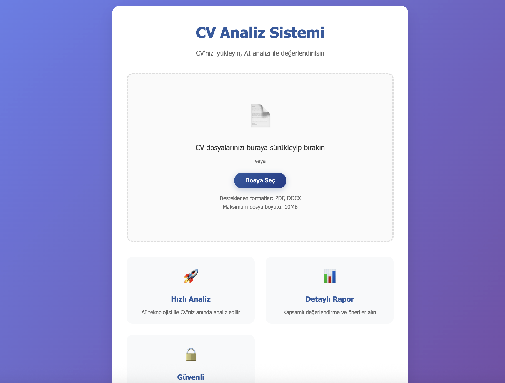
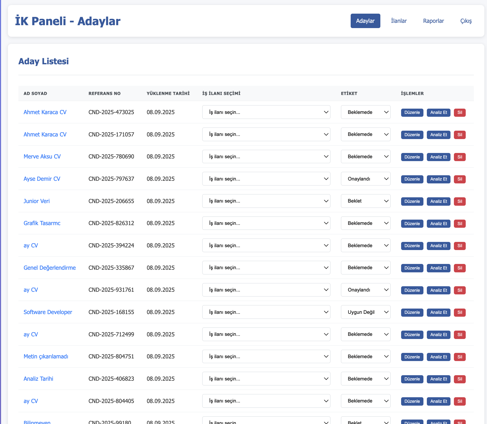
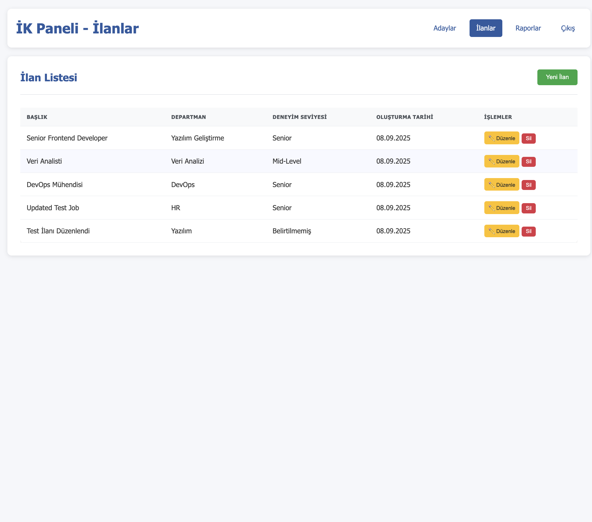
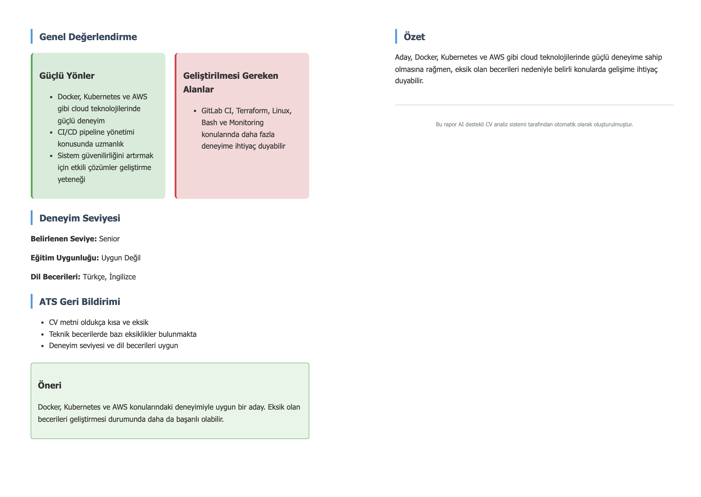

# CV Analiz Sistemi - AI Destekli Aday Değerlendirme Platformu

[](https://choosealicense.com/licenses/mit/)
[](https://nodejs.org/)
[](https://openai.com/)

CV Analiz Sistemi, İK uzmanları için geliştirilmiş yapay zeka destekli bir aday değerlendirme platformudur. Adaylar çoklu CV yükleyebilir (PDF/DOCX), sistem otomatik olarak isim ve bilgiler çıkarır. İK uzmanları ise ilan oluşturma, aday yönetimi, etiketleme, filtreleme ve detaylı raporlama gibi işlemleri kolayca yapabilir.

## 🚀 Özellikler

### Aday Tarafı
- **Çoklu CV Yükleme**: PDF ve DOCX formatlarında birden fazla CV yükleme
- **Drag & Drop**: Kolay dosya yükleme arayüzü
- **Otomatik İsim Çıkarma**: CV'den Türkçe karakter desteği ile isim çıkarma
- **Güvenli Yükleme**: Dosya güvenliği ve doğrulama

### İK Paneli
- **Aday Yönetimi**: Tüm adayları görüntüleme ve yönetme
- **İş İlanı Yönetimi**: İlan oluşturma, düzenleme ve silme
- **AI Analiz**: OpenAI GPT-3.5-turbo ile otomatik CV analizi
- **Rapor Sistemi**: Detaylı analiz raporları ve PDF indirme
- **Etiketleme**: Adayları kategorilere ayırma (Beklemede, İlk Görüşme, vb.)
- **Filtreleme**: Gelişmiş arama ve filtreleme seçenekleri
- **Puan Sistemi**: 0-100 arası otomatik puanlama

## 🛠️ Teknolojiler

### Backend
- **Node.js** - Sunucu çalışma ortamı
- **Express.js** - Web framework
- **SQLite** - Veritabanı
- **OpenAI API** - AI analiz motoru
- **Puppeteer** - PDF rapor oluşturma
- **Multer** - Dosya yükleme
- **JWT** - Kimlik doğrulama

### Frontend
- **Vanilla HTML/CSS/JavaScript** - Modern, responsive arayüz
- **Fetch API** - Backend iletişimi
- **Drag & Drop API** - Dosya yükleme

## 📦 Kurulum

1. **Projeyi klonlayın**
```bash
git clone https://github.com/yilmazbugra/Cv_Analyze_System_With_AI.git
cd Cv_Analyze_System_With_AI
```

2. **Bağımlılıkları yükleyin**
```bash
npm install
```

3. **Environment dosyasını oluşturun**
```bash
cp .env.example .env
```

4. **Environment değişkenlerini ayarlayın**
```bash
# .env dosyasını düzenleyin
OPENAI_API_KEY=your-openai-api-key-here
JWT_SECRET=your-jwt-secret-key
PORT=3000
```

5. **Sunucuyu başlatın**
```bash
npm start
```

6. **Tarayıcıda açın**
- Ana sayfa: http://localhost:3000
- İK Paneli: http://localhost:3000/ik/login.html

## 🔧 Yapılandırma

### OpenAI API Key
`.env` dosyasında OpenAI API anahtarınızı güncelleyin:
```env
OPENAI_API_KEY=your-openai-api-key-here
```

### İK Giriş Bilgileri
Varsayılan giriş bilgileri:
- **E-posta**: admin@ik.com
- **Şifre**: admin123

## 📁 Proje Yapısı

```
cv-analysis-system/
├── server.js                 # Ana sunucu dosyası
├── package.json              # Proje bağımlılıkları
├── .env.example              # Environment değişkenleri örneği
├── .gitignore                # Git ignore dosyası
├── database.sqlite           # SQLite veritabanı
├── uploads/                  # Yüklenen dosyalar
│   ├── cvs/                 # CV dosyaları
│   └── reports/             # PDF raporları
└── public/                   # Frontend dosyaları
    ├── index.html           # Ana sayfa
    ├── styles.css           # CSS stilleri
    ├── script.js            # JavaScript kodu
    └── ik/                  # İK paneli sayfaları
        ├── login.html       # Giriş sayfası
        ├── candidates.html  # Adaylar sayfası
        ├── jobs.html        # İlanlar sayfası
        └── reports.html     # Raporlar sayfası
```

## 🎯 Kullanım

### Aday Olarak
1. Ana sayfaya gidin (http://localhost:3000)
2. CV dosyanızı sürükleyip bırakın veya seçin
3. "Tümünü Yükle" butonuna tıklayın
4. Başarı mesajını bekleyin

### İK Uzmanı Olarak
1. İK paneline giriş yapın (http://localhost:3000/ik/login.html)
2. **Adaylar** sekmesinde yüklenen CV'leri görün
3. **İlanlar** sekmesinde iş ilanları oluşturun
4. **Raporlar** sekmesinde analiz yapın ve raporları indirin

## 🔍 AI Analiz Özellikleri

### Temel Analiz
- **Beceri Eşleştirme**: CV'deki becerileri iş ilanı ile karşılaştırma
- **Deneyim Değerlendirmesi**: Deneyim seviyesi analizi ve bonus puanlama
- **Eğitim Uyumu**: Eğitim geçmişi değerlendirmesi
- **Dil Becerileri**: Dil yeterliliği analizi

### Detaylı Değerlendirme
- **Güçlü Yönler**: Adayın güçlü olduğu alanlar
- **Zayıf Yönler**: Geliştirilmesi gereken alanlar
- **Eksik Beceriler**: İş ilanında istenen ancak CV'de bulunmayan beceriler
- **Kısmi Eşleşen Beceriler**: Benzer ancak tam eşleşmeyen beceriler

### Akıllı Puanlama Sistemi
- **Genel Pozisyonlar**: 20-30 puan (düşük puanlama)
- **Spesifik Pozisyonlar**: 0-100 puan (deneyim ve beceri bazlı)
- **Deneyim Bonusu**: 10+ yıl deneyim için +15-20 puan
- **Beceri Eşleşme Oranı**: %70+ eşleşme için yüksek puan

### AI Önerileri
- **İyileştirme Önerileri**: CV'yi güçlendirmek için öneriler
- **Eksik Beceriler**: Öğrenilmesi gereken teknolojiler
- **Kariyer Yönlendirmesi**: Uygun pozisyon önerileri

## 🏷️ Etiketleme Sistemi

- **Beklemede**: Yeni yüklenen CV'ler
- **İlk Görüşme**: Mülakata davet edilenler
- **Uygun Değil**: Uygun olmayan adaylar
- **Beklet**: Gelecekte değerlendirilecekler
- **Onaylandı**: Kabul edilen adaylar

## 📊 Filtreleme Seçenekleri

- **Arama**: Aday adı, referans numarası veya iş ilanı başlığına göre
- **Etiket Filtresi**: Belirli etiketlere sahip adayları filtreleme
- **Puan Filtresi**: Belirli puan aralığındaki adayları filtreleme
- **Tarih Sıralaması**: En yeni veya en eski raporları görüntüleme

## 🎨 Ekran Görüntüleri

### Ana Sayfa - CV Yükleme

*Modern drag & drop arayüzü ile kolay CV yükleme*

### İK Paneli - Adaylar

*Tüm adayları görüntüleme ve yönetme paneli*

### İK Paneli - İlanlar

*İş ilanı oluşturma ve yönetme sayfası*

### İK Paneli - AI Raporlar

*Analiz raporlarını görüntüleme ve indirme sayfası*

### AI CV Analiz Detayları

*OpenAI GPT-3.5-turbo ile oluşturulan detaylı analiz raporu*

## 🔒 Güvenlik

- **JWT Token**: Güvenli kimlik doğrulama
- **Dosya Doğrulama**: Sadece PDF ve DOCX dosyaları kabul edilir
- **Dosya Boyutu Limiti**: Maksimum 10MB dosya boyutu
- **Environment Variables**: Hassas bilgiler .env dosyasında saklanır

## 🚀 Geliştirme

### Geliştirme Ortamı
```bash
# Geliştirme modunda çalıştırma
npm run dev

# Nodemon ile otomatik yeniden başlatma
npm install -g nodemon
nodemon server.js
```

### Test
```bash
# Test çalıştırma
npm test
```

## 📝 Lisans

Bu proje MIT lisansı altında lisanslanmıştır. Detaylar için [LICENSE](LICENSE) dosyasına bakın.

## 🤝 Katkıda Bulunma

1. Fork yapın
2. Feature branch oluşturun (`git checkout -b feature/AmazingFeature`)
3. Commit yapın (`git commit -m 'Add some AmazingFeature'`)
4. Branch'i push edin (`git push origin feature/AmazingFeature`)
5. Pull Request oluşturun

## 📞 İletişim

- **Proje Sahibi**: [yilmazbugra](https://github.com/yilmazbugra)
- **Proje Linki**: [https://github.com/yilmazbugra/Cv_Analyze_System_With_AI](https://github.com/yilmazbugra/Cv_Analyze_System_With_AI)

## 🙏 Teşekkürler

- [OpenAI](https://openai.com/) - AI analiz motoru
- [Puppeteer](https://pptr.dev/) - PDF oluşturma
- [Express.js](https://expressjs.com/) - Web framework
- [SQLite](https://www.sqlite.org/) - Veritabanı

---

⭐ Bu projeyi beğendiyseniz yıldız vermeyi unutmayın!